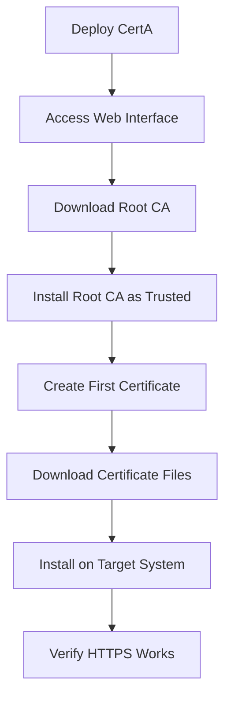

# CertA Documentation

Welcome to the CertA Certification Authority documentation. This comprehensive guide will help you understand, deploy, and use CertA effectively.

## 📚 Documentation Overview

CertA is a complete, self-hosted Certification Authority built with ASP.NET Core that allows you to create and manage your own trusted certificates for internal infrastructure.

## 🚀 Quick Start

1. **Deploy CertA**: [Deployment Guide](DEPLOYMENT.md#quick-start-with-docker)
2. **Install Root CA**: [User Guide - CA Installation](USER_GUIDE.md#installing-the-root-ca-certificate)
3. **Create First Certificate**: [User Guide - Creating Certificates](USER_GUIDE.md#creating-certificates)

## 📖 Documentation Sections

### For Users
- **[User Guide](USER_GUIDE.md)** - Complete guide for end users
  - Getting started with CertA
  - Understanding certificates and CA
  - Creating and managing certificates
  - Installing certificates on various platforms
  - Troubleshooting common issues
  - Best practices for certificate management

### For Administrators
- **[Deployment Guide](DEPLOYMENT.md)** - Comprehensive deployment instructions
  - Development environment setup
  - Production deployment (manual and automated)
  - Docker and Kubernetes deployment
  - High availability configuration
  - Security hardening
  - Monitoring and logging
  - Backup and recovery procedures

### For Developers
- **[API Documentation](API.md)** - Complete API reference
  - REST API endpoints
  - Request/response formats
  - Authentication and security
  - Code examples (cURL, PowerShell)
  - Error handling and status codes

- **[Architecture Documentation](ARCHITECTURE.md)** - Technical architecture details
  - System architecture overview
  - Component design and responsibilities
  - Database schema
  - Security architecture
  - Performance considerations
  - Future enhancements

## 🎯 Use Cases

### Internal Infrastructure
- **Web Servers**: Secure internal websites and applications
- **API Services**: HTTPS endpoints for microservices
- **Load Balancers**: SSL termination and client authentication
- **VPN Services**: Client certificate authentication
- **Development**: Local development certificates

### Enterprise Environments
- **Corporate Intranets**: Internal web applications
- **DevOps Tools**: CI/CD pipeline security
- **Monitoring Systems**: Secure monitoring dashboards
- **Database Connections**: Encrypted database connections

## 🔧 Key Features

### Certificate Management
- ✅ **Root CA Management**: Create and manage your own CA
- ✅ **CA-Signed Certificates**: Issue certificates signed by your CA
- ✅ **Multiple Formats**: PEM and PKCS#12 (PFX) support
- ✅ **Subject Alternative Names**: Support for multiple domains
- ✅ **Certificate Types**: Server and client certificates

### Web Interface
- ✅ **Modern UI**: Bootstrap-based responsive design
- ✅ **Certificate Creation**: Simple form-based certificate creation
- ✅ **Download Options**: Multiple format downloads
- ✅ **CA Information**: Root CA details and download
- ✅ **Certificate Details**: Full certificate information display

### Security
- ✅ **Proper CA Hierarchy**: Root CA → Issued Certificates
- ✅ **Strong Cryptography**: RSA 2048-bit (certificates), 4096-bit (CA)
- ✅ **X.509 Compliance**: Full X.509 certificate standards
- ✅ **Trust Chain**: Install root CA to establish trust

## 🏗️ Technology Stack

- **Backend**: ASP.NET Core 9.0
- **Database**: PostgreSQL 15+
- **Frontend**: Bootstrap 5, Razor Views
- **Cryptography**: .NET System.Security.Cryptography
- **Containerization**: Docker and Docker Compose
- **Deployment**: Kubernetes support

## 📋 Prerequisites

### For Users
- Modern web browser
- Access to CertA web interface
- Basic understanding of certificates

### For Deployment
- Docker and Docker Compose (recommended)
- OR .NET 9.0 SDK and PostgreSQL
- 4GB+ RAM, 50GB+ storage
- Linux, Windows, or macOS

## 🔄 Getting Started Workflow

## 🛠️ Common Tasks

### Quick Certificate Creation
1. Navigate to **Certificates > Create**
2. Enter domain name (e.g., `example.com`)
3. Add SANs if needed (e.g., `www.example.com`)
4. Select certificate type (Server/Client)
5. Click **Create Certificate**
6. Download certificate files

### Installing Root CA
- **Windows**: Import to Trusted Root Certification Authorities
- **macOS**: Add to System keychain with "Always Trust"
- **Linux**: Copy to `/usr/local/share/ca-certificates/` and run `update-ca-certificates`

### Web Server Configuration
- **Apache**: Configure SSL with certificate and private key files
- **Nginx**: Set `ssl_certificate` and `ssl_certificate_key` directives
- **IIS**: Import PFX file and bind to HTTPS

## 🔍 Troubleshooting

### Common Issues
1. **Certificate Not Trusted**: Install root CA as trusted authority
2. **PFX Import Fails**: Verify password (default: "password")
3. **Web Server Won't Start**: Check file permissions and configuration
4. **Database Connection**: Verify PostgreSQL is running

### Getting Help
1. Check the [User Guide Troubleshooting](USER_GUIDE.md#troubleshooting) section
2. Review [Deployment Guide](DEPLOYMENT.md#troubleshooting) for deployment issues
3. Check application logs for detailed error information
4. Create an issue in the repository with detailed information

## 📈 Roadmap

### Planned Features
- [ ] **ACME Protocol Support**: Let's Encrypt compatible automated certificate issuance
- [ ] **Certificate Revocation**: CRL and OCSP support
- [ ] **Intermediate CAs**: Multi-level CA hierarchy
- [ ] **API Authentication**: Secure API access
- [ ] **Certificate Monitoring**: Expiry alerts and monitoring
- [ ] **Integration**: Popular web server and cloud platform integrations

### Security Enhancements
- [ ] **HSM Support**: Hardware Security Module integration
- [ ] **Multi-Factor Authentication**: Enhanced access control
- [ ] **Audit Logging**: Comprehensive security event logging
- [ ] **Certificate Templates**: Predefined certificate configurations

## 🤝 Contributing

We welcome contributions to CertA! Please see the main README for contribution guidelines.

### Development Setup
1. Clone the repository
2. Install .NET 9.0 SDK
3. Set up PostgreSQL database
4. Run the application locally
5. Make your changes
6. Submit a pull request

## 📄 License

CertA is licensed under the MIT License. See the LICENSE file for details.

## 🆘 Support

### Documentation Issues
- Create an issue in the repository
- Specify which documentation section needs improvement
- Provide specific examples or use cases

### Technical Issues
- Check the troubleshooting sections in the guides
- Review application and system logs
- Create an issue with detailed error information
- Include system configuration and environment details

---

## 📞 Quick Reference

### Important URLs
- **Web Interface**: `http://your-server:8080`
- **Certificate List**: `http://your-server:8080/Certificates`
- **CA Information**: `http://your-server:8080/Certificates/Authority`
- **Create Certificate**: `http://your-server:8080/Certificates/Create`

### Default Credentials
- **PFX Password**: `password`
- **Database**: Created automatically
- **Admin Access**: No authentication required (development)

### File Formats
- **PEM**: Text-based format for certificates and keys
- **PFX/PKCS#12**: Binary format for Windows systems
- **CA Certificate**: Root CA in PEM format

---

**CertA** - Your trusted Certification Authority for internal infrastructure.

*Last updated: August 2025*
